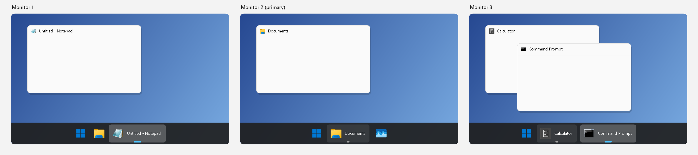
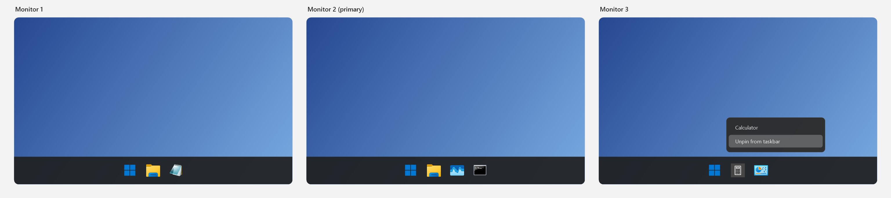

# Independent taskbar per monitor

[Windhawk](https://windhawk.net) mod for Windows 11: each taskbar behaves like its own main taskbar.

* Each taskbar shows only the windows of its own monitor.
* Pin/unpin from the jump list applies to that taskbar only.
* Pin *Properties* can differ per taskbar.
* Clicking the pin of a running app brings its window to the front.

Requires Windows 11 and *Show my taskbar on all displays*.

## Install

Windhawk → *Create a new mod* → paste [`taskbar-independent-per-monitor.wh.cpp`](taskbar-independent-per-monitor.wh.cpp) → *Compile Mod*.

## License

[MIT](LICENSE)
